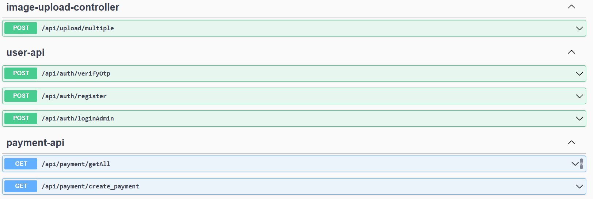
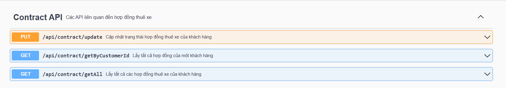
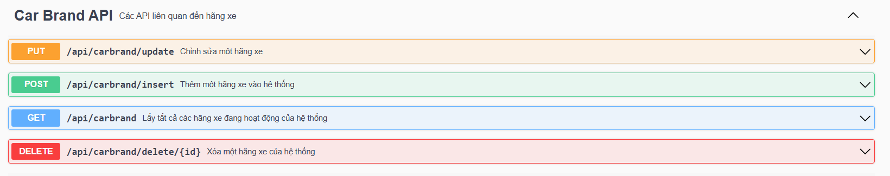
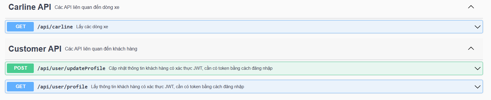
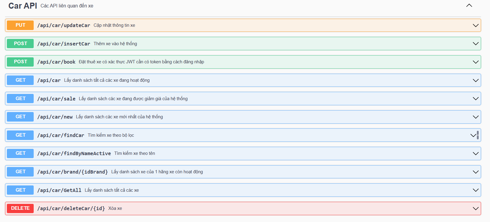
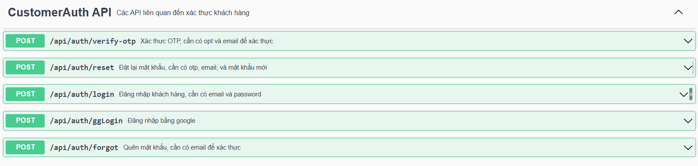

# 🚗 RentalCar - Giới thiệu

- RentalCar là một dự án backend sử dụng Spring Boot để xây dựng các API Web Services chuẩn REST cho hệ thống thuê xe trực tuyến
- Dự án cung cấp đầy đủ các chức năng phục vụ cho quy trình thuê xe từ phía người dùng và quản trị viên, bao gồm:
  - Đối với người dùng:
    - Đăng ký, đăng nhập bằng gmail GG
    - Khôi phục mật khẩu
    - Cập nhật thông tin người dùng
    - Tìm kiếm xe, có bộ lọc để cụ thể hóa mục tiêu
    - Xem chi tiết thông tin xe (hình ảnh, mô tả, giá cả,...)
    - Đặt xe theo ngày mong muốn
    - Thanh toán
    - Xem lại lịch sử thuê xe
  - Đối với quản trị viên:
    - Quản lý hãng xe
    - Quản lý xe
    - Thống kê doanh thu
- Mọi người có thể xem các API và test các API sau khi đã clone về với link sau đây:
```bash
http://localhost:8081/swagger-ui/index.html#/
```
---

<div style="text-align: center;">
  <div>
    
  </div>
  <div>
    
  </div>
  <div>
    
  </div>
  <div>
    
  </div>
  <div>
    
  </div>
  <div>
    
  </div>
</div>


## ⚙️ Công nghệ sử dụng
- Spring Boot (REST API)
- Spring Security + JWT
- MySQL
- JavaMail (OTP)
- Maven
- JPA (Hibernate)
---

## 📦 Yêu cầu hệ thống

Trước khi chạy dự án, hãy đảm bảo bạn đã cài đặt:

- ✅ Java JDK 22
- ✅ Maven 3.9.9
- ✅ MySQL (dùng Cloud DB của Aiven)
- ✅ Redis (cài local trên port 6379)
- ✅ IDE như IntelliJ IDEA, Eclipse hoặc VSCode

---

## 🚀 Cách chạy dự án

### 1. Clone source code từ GitHub
```bash
git clone https://github.com/phamhoanghuy2004/RentalCar.git
cd RentalCar
```

### 2. Cấu hình kết nối
Mở file src/main/resources/application.properties và chắc chắn cấu hình đúng như sau:
```bash
server.port=8081
server.address=0.0.0.0
spring.datasource.url=${DB_URL}
spring.datasource.username=${DB_USER}
spring.datasource.password=${DB_PASSWORD}
spring.redis.host=localhost
spring.redis.port=6379
spring.jpa.hibernate.ddl-auto=update
spring.jpa.show-sql=true
spring.datasource.driver-class-name=com.mysql.cj.jdbc.Driver
spring.jpa.database-platform=org.hibernate.dialect.MySQL8Dialect
upload.directory=uploads
spring.servlet.multipart.max-file-size=10MB
spring.servlet.multipart.max-request-size=20MB
```

### 3. Cấu hình các biến môi trường
- DB_PASSWORD = AVNS_439qsgZdIKzTmluCfBg
- DB_URL = jdbc:mysql://mysql-2cc2c868-phamhoanghuy-96f0.e.aivencloud.com:15293/rentalcar?ssl-mode=REQUIRED
- DB_USER = avnadmin
- JWT_SECRET = dALEq7X6po7DFjeXCbvQOxiHuil9pdtO6lNED5Q849BY+hRaVeKwFjbjHtsd+FDo

### 4. Build và chạy ứng dụng
```bash
mvn clean install
mvn spring-boot:run
```

---

## 👤 Thông tin tác giả
- Tác giả: Phạm Hoàng Huy
📧 Email: phamhoanghuy.2000vn@gmail.com
- Tác giả: Trần Thanh Nhã
📧 Email: ttn04042004@gmail.com
